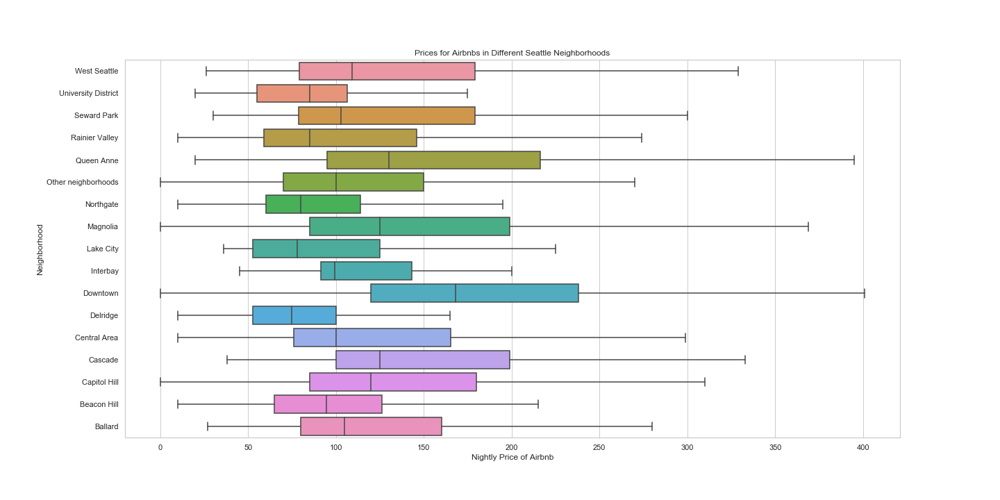
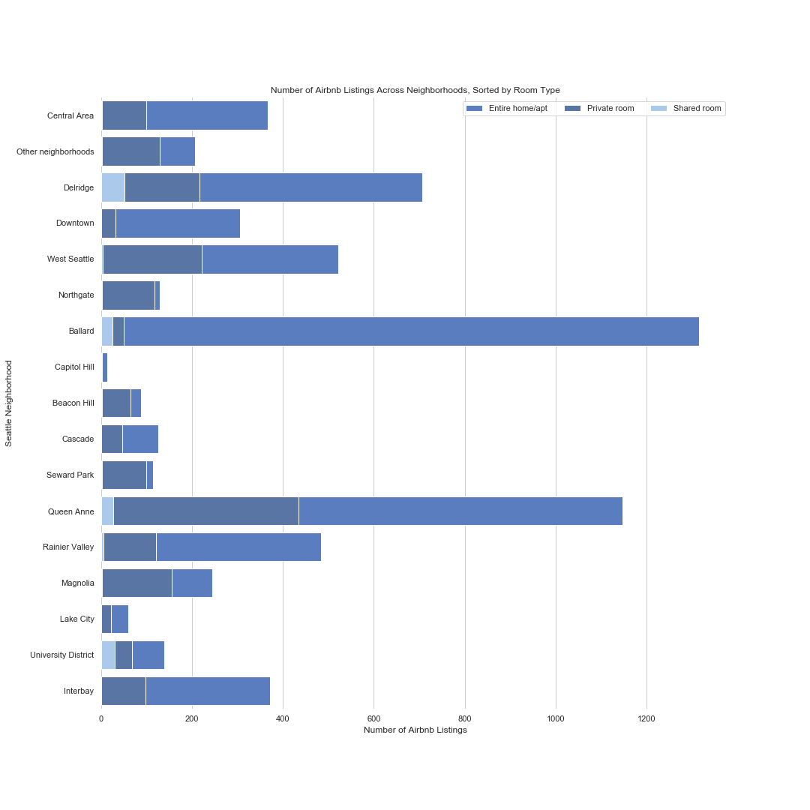
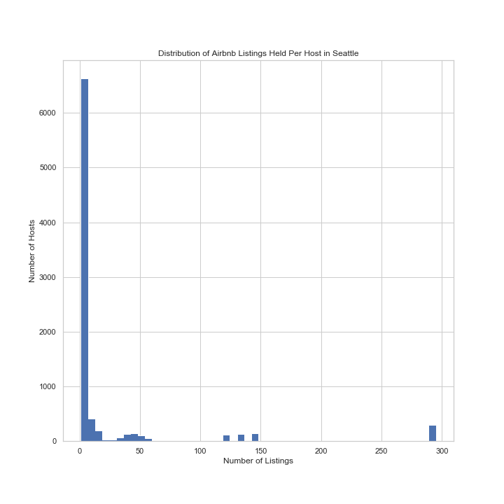
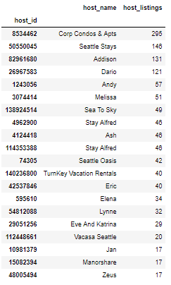
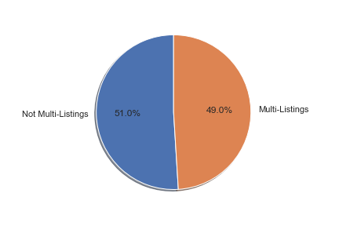

```{r setup, include=FALSE}
knitr::opts_chunk$set(echo = TRUE)
```

> Jill Nguyen, Pooja Ramanathan, Shiva Rithwick, Victoria Huynh

## Introduction
As home-sharing rental sites become more popular, the housing market of urban areas change more and more. Gentrification is a rising problem in many American cities today. While gentrification is usually attributed to an influx of new affluent residents into a neighborhood, the purchase of properties in a neighborhood solely to house short-term visitors may also be an overlooked factor. Using this resource, we want to answer **QUESTION HERE**.  
In this resource, we will specifically look at Airbnb's impact on Seattle's neighborhoods{, starting from 2011}.  

## Our Dataset
The dataset we are using is provided by [Inside Airbnb](http://insideairbnb.com/get-the-data.html) (2019). It includes information about Airbnb listings in Seattle. It has been cleaned to remove columns not relevant to our research. {We also added X new columns: `x`, `x`, and `x`. (add if true)}  
Below is a sample of our dataset.  
{DATASET HEAD}  
{WHAT EACH COLUMN REPRESENTS BUT MAYBE NOT BC THERE ARE 65}

## Data Exploration
We did a further exploration on our dataset to familiarize ourselves with its variables.









 


```{r include=FALSE}
knitr::opts_chunk$set(echo = F) # Source in the other script
source("AirBnb.R")
```

### Distribution of Airbnb homes around Seattle

This graph shows the distribution of Airbnb homes around the Seattle area. Each dot represents a listing and you can hover over each listing to get more information. Each listing is also colour accoiding to the number of bedrooms. The first thing noticable is that most listings are listings for single bedrooms as there is an ambundance of yellow dots. We can also see that the listings are focused near the central Seattle area as this is where most business activity takes place

```{r}
leaflet_map
```

### Correlation Heatmaps

Correlation heatmap plots are used to visualize association matrices. The color indicates the sign of the coefficient and the intensity of the color increases proportionally with the magnitude of the correlation coefficient. We can use this graphs to remove variables with high correlation to either mutate them into one, or pick the better variable. This also allows use to see which variables have no correlation with any of the variables and thus remove them.

```{r}
corrplot(plot_10, type = 'full', tl.col = 'black', method="shade")
corrplot(plot_20, type = 'full', tl.col = 'black', method="shade")
corrplot(plot_30, type = 'full', tl.col = 'black', method="shade")
```


## Modeling
We used {MODEL} model to predict whether or not a listing was used for personal{FIX WORDING?} or commercial purposes.  
{INFO ABOUT MODEL}