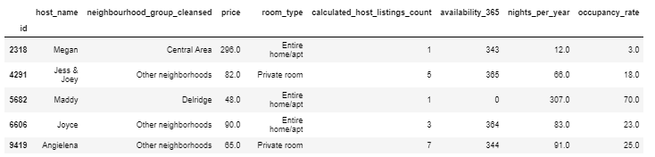

```{r setup, include=FALSE}
knitr::opts_chunk$set(echo = TRUE)
```

> Jill Nguyen, Pooja Ramanathan, Shiva Rithwick, Victoria Huynh

## Introduction
As home-sharing rental sites become more popular, the housing market of urban areas change more and more. Gentrification is a rising problem in many American cities today. While gentrification is usually attributed to an influx of new affluent residents into a neighborhood, the purchase of properties in a neighborhood solely to house short-term visitors may also be an overlooked factor. Since gentrification is a difficult topic to address, we decided to instead focus on the general state of the Airbnb market in Seattle today and how it may be indicative of an overall commercialization of the short-term rental market.

Using this resource, we want to answer **how various facets of the Seattle Airbnb market reflect an overall commercialization of properties in the area**.  

In this resource, we will specifically look at the Airbnb market in various Seattle neighborhoods from 2011 to 2019.  

## Our Dataset
The dataset we are using is provided by [Inside Airbnb](http://insideairbnb.com/get-the-data.html) (2019). It includes information about Airbnb listings in Seattle. It has been cleaned to remove columns not relevant to our research. We have also added new columns calculated based on Inside Airbnb's algorithms for analysis: `nights_per_year`, and `occupancy_rate`.

Below is a sample of our dataset. 




## Data Exploration
We did a further exploration on our dataset to familiarize ourselves with its variables.


Our first plot looks at the distribution of prices of Airbnb for different Seattle neighborhoods. Noticably, the median price for the Downtown neighborhood is highest, while the lowest median price seems to be in Delridge.


Next, we explore the distribution of room types in Airbnbs across neighborhoods. According to InsideAirbnb, depending on the room type of an airbnb listing, the property could be being used more like a hotel, or be taking away potential housing for people in the area.


We also can break down the pricing for the various room types, and unsurprisingly, the entire house or apartment listings are much more expensive.


We also break down the number of listings held by Airbnb hosts in Seattle. While the majority of owners appear to only have one listing, when you break the listings down by how many multilistings are held, the results look drastically different.


Here is a table displaying the most listings held by various hosts in Seattle. From this table, we can see that the top hosts have a shocking number of listings, providing evidence towards their Airbnb account being run like a business. Many of the host names seem to resemble business names as well.

 

This pie chart shows that the number of properties which are under a multilisting owner nearly outnumber those that are just single listings.


Using InsideAirbnb's metric based on average number of reviews per month and nights spent in a listing per year, we calculated occupancy rates for properties in Seattle. It is clear that there is a downward trend of occupancy rates for listings, and yet at the peak capacity for occupancy, the number of listings with high occupancy skyrockets.


```{r include=FALSE}
knitr::opts_chunk$set(echo = F) # Source in the other script
source("AirBnb.R")
```

### Distribution of Airbnb homes around Seattle

This graph shows the distribution of Airbnb homes around the Seattle area. Each dot represents a listing and you can hover over each listing to get more information. Each listing is also colour accoiding to the number of bedrooms. The first thing noticable is that most listings are listings for single bedrooms as there is an ambundance of yellow dots. We can also see that the listings are focused near the central Seattle area as this is where most business activity takes place

```{r}
leaflet_map
```

### Correlation Heatmaps

Correlation heatmap plots are used to visualize association matrices. The color indicates the sign of the coefficient and the intensity of the color increases proportionally with the magnitude of the correlation coefficient. We can use this graphs to remove variables with high correlation to either mutate them into one, or pick the better variable. This also allows use to see which variables have no correlation with any of the variables and thus remove them.

```{r}
beds_plot
corrplot(plot_10, type = 'full', tl.col = 'black', method="shade")
corrplot(plot_20, type = 'full', tl.col = 'black', method="shade")
corrplot(plot_30, type = 'full', tl.col = 'black', method="shade")
```


## Modeling
We used {MODEL} model to predict whether or not a listing was used for personal{FIX WORDING?} or commercial purposes.  
{INFO ABOUT MODEL}