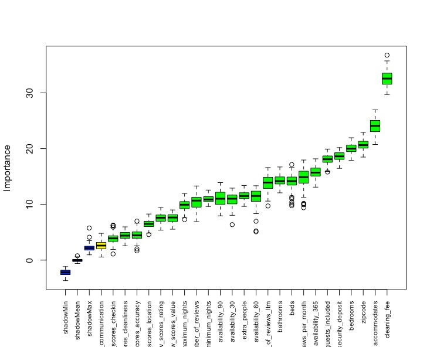

```{r setup, include=FALSE}
knitr::opts_chunk$set(echo = TRUE)
```

> Jill Nguyen, Pooja Ramanathan, Shiva Rithwick, Victoria Huynh


## Introduction
As home-sharing rental sites become more popular, the housing market of urban areas change more and more. Gentrification is a rising problem in many American cities today. While gentrification is usually attributed to an influx of new affluent residents into a neighborhood, the purchase of properties in a neighborhood solely to house short-term visitors may also be an overlooked factor. In essence, "the growth of short-term rentals is closely tied to the broader financialisation of housing that makes housing a commodity, erodes the neighborhood identity, attracts new investors for buying or developing more and more units, which in turn increases the scarcity of housing, prompts landlords to raise rent, threatens community bonds and stretches neighbourhood services". [(Bernardi)](https://labgov.city/thecommonspost/the-impact-of-airbnb-on-our-cities-gentrification-and-disneyfication-2-0/) However, since gentrification is a difficult topic to address, we decided to instead focus on the general state of the Airbnb market in Seattle today and how it may be indicative of an overall commercialization of the short-term rental market, as cities that have prominent tourism, such as Seattle, may attract commercialism.

Using this resource, we want to answer **how various facets of the Seattle Airbnb market reflect an overall commercialization of properties in the area**. We also want to see if we can **predict what variables of Airbnb listings influence pricings the most** and **if we can predict which of the Airbnb ventures in Seattle are "commercial ventures"**.

In this resource, we will specifically look at the Airbnb market in various Seattle neighborhoods from 2011 to 2019.  

## Our Dataset
The dataset we are using is provided by [Inside Airbnb](http://insideairbnb.com/get-the-data.html) (2019). It includes information about Airbnb listings in Seattle. They state that this data is sourced from publicly available information from the Airbnb website, and has been analyzed, cleansed and aggregated where appropriate to faciliate public discussion. The datasets contain listing information, calendar dates for listings, reviews for listings, and a list of neighborhoods in the city. It has been cleaned by us to remove columns not relevant to our research. We also added the new columns of "nights_per_year" and "occupancy_rate", which were calculating using algorithms Inside Airbnb uses in its analyses of cities. The columns themselves were calculated using average reviews per month and the minimum number of nights stayed per listing.


## Data Exploration
We did a further exploration on our dataset to familiarize ourselves with its variables.


Our first plot looks at the distribution of prices of Airbnb for different Seattle neighborhoods. Noticably, the median price for the Downtown neighborhood is highest, while the lowest median price seems to be in Delridge. Since Downtown Seattle is a hub for tourist activity, this could be indicative of commercialization.


Next, we explore the distribution of room types in Airbnbs across neighborhoods. According to InsideAirbnb, depending on the room type of an airbnb listing, the property could be being used more like a hotel, or be taking away potential housing for people in the area. This is because if an owner is renting out an entire house or apartment, it implies the property is one they do not actually live in, as opposed to an owner who is merely renting out a room in their home. It appears that for nearly all neighborhoods, the "entire house/apartment" room type makes up the bulk of listings. Additionally, Ballard and Queen Anne appear to have the most listings overall, which is surprising considering their average pricing shown above.


We also can break down the pricing for the various room types, and unsurprisingly, the entire house or apartment listings are much more expensive, which means they would be more lucrative for their owners.


We also break down the number of listings held by Airbnb hosts in Seattle. While the majority of owners appear to only have a handful of listings, there are also quite a few hosts who own dozens or more properties. when we break the listings down by how many multilistings are held, we can see exactly how many of the properties in Seattle are owned by the same owner.


Here is a table displaying the most listings held by various hosts in Seattle. From this table, we can see that the top hosts have a shocking number of listings, providing evidence towards their Airbnb account being run like a business. Many of the host names seem to resemble business names as well, making their true purposes evident.

 

This pie chart shows that the number of properties which are under a multilisting owner almost match those that are just single listings, taking up nearly half of the chart.


Using InsideAirbnb's metric based on average number of reviews per month and nights spent in a listing per year, we calculated occupancy rates for properties in Seattle. We followed InsideAirbnb's justification for capping the occupancy rate, as they use "a maximum occupancy rate of 70% to ensure the occupancy model does not produce artifically high results based on the available data". It is clear that there is a downward trend of occupancy rates for listings, and yet at the peak capacity for occupancy, the number of listings with high occupancy skyrockets. High occupancy rates can be indicative of how lucrative properties would be for Airbnb owners, and knowing that many Airbnb properties are entire houses/apts, they are also further evidence these properties do not actually have their owners living in them.


```{r include=FALSE}
knitr::opts_chunk$set(echo = F) # Source in the other script
source("AirBnb.R")
```

### Distribution of Airbnb homes around Seattle

This graph shows the distribution of Airbnb homes around the Seattle area. Each dot represents a listing and you can hover over each listing to get more information. Each listing is also colour accoiding to the number of bedrooms. The first thing noticable is that most listings are listings for single bedrooms as there is an ambundance of yellow dots. We can also see that the listings are focused near the central Seattle area as this is where most business activity takes place.

```{r}
leaflet_map
```

### Correlation Heatmaps

Correlation heatmap plots are used to visualize association matrices. The color indicates the sign of the coefficient and the intensity of the color increases proportionally with the magnitude of the correlation coefficient. We can use this graphs to remove variables with high correlation to either mutate them into one, or pick the better variable. This also allows use to see which variables have no correlation with any of the variables and thus remove them.

```{r}
corrplot(plot_10, type = 'full', tl.col = 'black', method="shade")
corrplot(plot_20, type = 'full', tl.col = 'black', method="shade")
corrplot(plot_30, type = 'full', tl.col = 'black', method="shade")
```


## Modeling


Here we are taking the liberty to make few simplifications regarding the data for the purpose of modeling. To perform **Spearman and Kendall-Tau Correlation** Analysis, we simplify the information regarding the data that the values of the predictors have some kind of order to them, that is, they're either increasing or decreasing. These Spearman and Kendall Coefficients helps us determine if the predictor has a non-linear relationship with the response variable.

We decided to chose *Poisson Regression* because it is useful for predicting an outcome variable representing counts from a set of continuous predictor variables. We performed the analysis using *Negative Binomial Regression* as well, Negative binomial regression can be used for over-dispersed count data, that is when the conditional variance exceeds the conditional mean. However, Negative binomial regression can be considered as a generalization of Poisson regression since it has the same mean structure as Poisson regression and it has an extra parameter to model the over-dispersion. If the conditional distribution of the outcome variable is over-dispersed, the confidence intervals for Negative binomial regression are likely to be narrower as compared to those from Poisson regression. Thus, our outputs were very similar, and Poisson regression outperformed negative binomial regression by a very narrow margin.

We used **Recursive Feature Elimination Method** to obtain the best subset of the feature variables. It is a greedy optimization algorithm which aims to find the best performing feature subset. It repeatedly creates models and keeps aside the best or the worst performing feature at each iteration. It constructs the next model with the left features until all the features are exhausted. It then ranks the features based on the order of their elimination. We used Recursive Feature Elimination Method instead of Forward Selection method because we learned that the former provides more accurate and detailed feature selection algorithm, and we wanted to experiment a new method as well, in fact, it turned out very successful.

 

 
 
 


